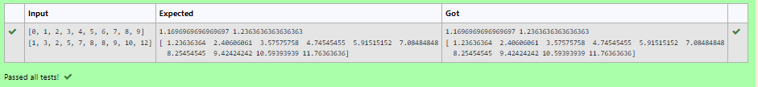

# Implementation of Univariate Linear Regression
## Aim:
To implement univariate Linear Regression to fit a straight line using least squares.

## Equipment’s required:


Hardware – PCs

Anaconda – Python 3.7 Installation / Moodle-Code Runner

## Algorithm:

### Step 1:	
Get the independent variable X and dependent variable Y.

### Step 2:	
Calculate the mean of the X -values and the mean of the Y -values.

### Step 3:	
Find the slope m of the line of best fit using the formula.
 

### Step 4:	
Compute the y -intercept of the line by using the formula:
  

### Step 5:	
Use the slope m and the y -intercept to form the equation of the line.

### Step 6:
Obtain the straight line equation Y=mX+b and plot the scatterplot.

## Program
```

Program for Univariate linear regression using the least squares method.
Developed by: Sarankumar J
RegisterNumber: 21500780

import numpy as np

X = np.array(eval(input()))
Y = np.array(eval(input()))


X_mean =np.mean(X)
Y_mean=np.mean(Y)

num=0
denom=0

for i in range(len(X)):
    num+=(X[i] -X_mean)*(Y[i]-Y_mean)
    denom+= (X[i]-X_mean)**2
    
m=num/denom

b=Y_mean-m*X_mean

print(m,b)

y=m*X+b
print(y)


```
## Sample Input and Output




## Result

The univariate Linear Regression was implemented to fit a straight line using least squares.
